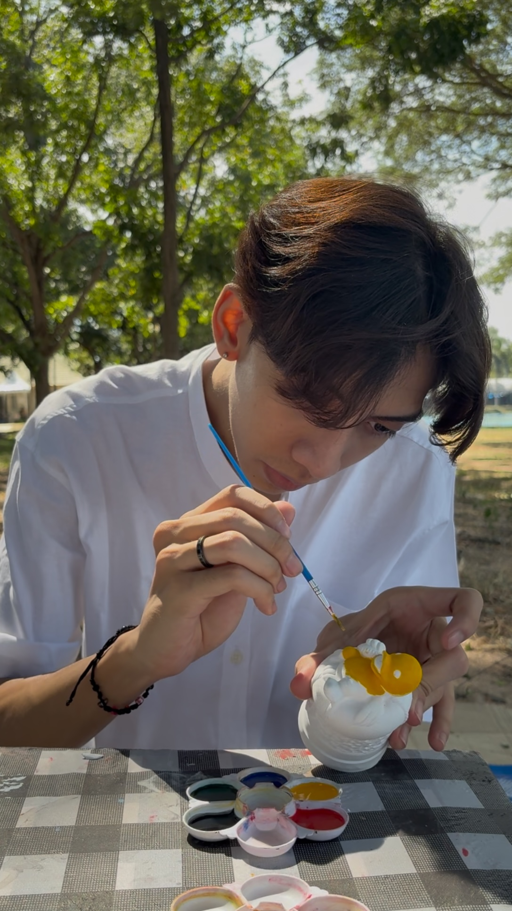

# About me
# Hello, I'm Punyavee Somboonranee (Pun) 👋
and I am currently a third-year student. from Kasetsart University, Sriracha Campus. I am pursuing a bachelor's degree in Computer Science under the Special Program at the Faculty of Science, Sriracha.
# Skills:
- Programming: Python, html
- Tools: Git, Visual Studio Code

# Follow me on:
   
   
   
   
   
