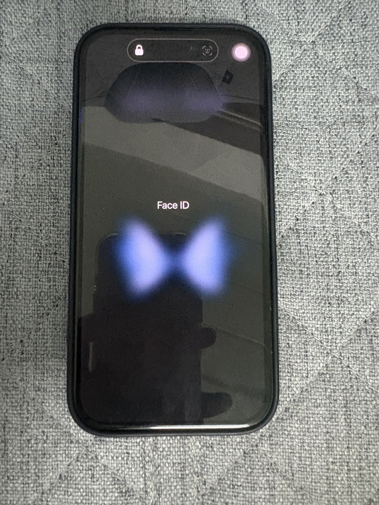
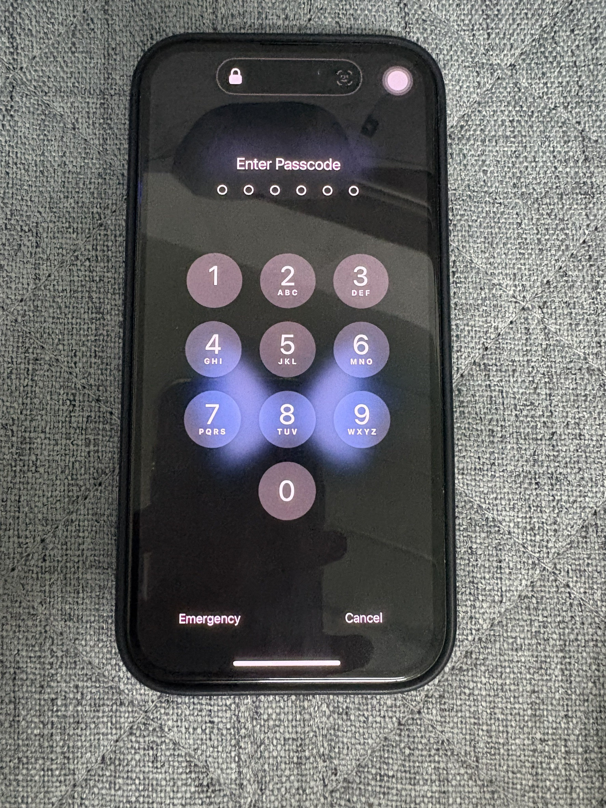

# Security-Control

# รหัสผ่านและ แสกนใบหน้า ( Password & Fade ID Scan)

- **Location** : My Telephone
- **Type of SecurityControl** : Technical Controls
- **Control Function** : Preventative

<h3>เหตุผลที่จัดเป็น Physical Control</h3>
	
  - แม้ตัวรหัสผ่านจะเป็นมาตรการทางเทคนิค(Technical Control) แต่ช่วยรักษาความปลอดภัยเชิงกายภาพของข้อมูลและอุปกรณ์
	
  - ปกป้องตัวอุปกรณ์มือถือ (ซึ่งเป็นทรัพย์สินทางกายภาพ) จากการถูกเข้าถึงโดยไม่ได้รับอนุญาต
	
  - การใช้งานเชิงกายภาพ: ผู้ใช้ต้องใส่รหัสผ่านที่กำหนดไว้หรือ แสกนใบหน้าจึงจะเข้าถึงอุปกรณ์ได้

<h3>เหตุผลที่เป็น Preventative Control</h3>
	
  - เป็นวิธีการ ป้องกันการเข้าถึงข้อมูล หรืออุปกรณ์โดยไม่ได้รับอนุญาต 
	
  - ใช้เทคโนโลยีการแสกนม่านตาหรือ ที่เราเรียกว่าแสกนใบหน้าเป็นหลักในการเข้าถึงโทรศัพทร์
	
  - ควบคุมความปลอดภัยด้วยฮาร์ทแวร์(Hardware) และซอฟร์แวร์(Software) โดยไม่ต้องใช้บุคคล

<< [Back](README.md)
